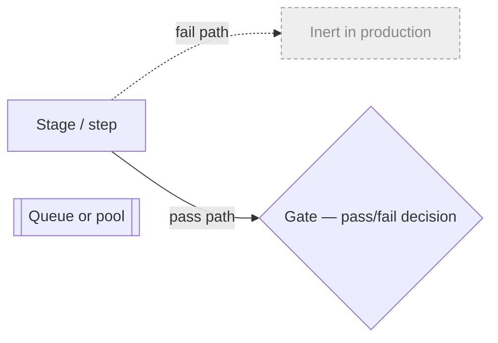
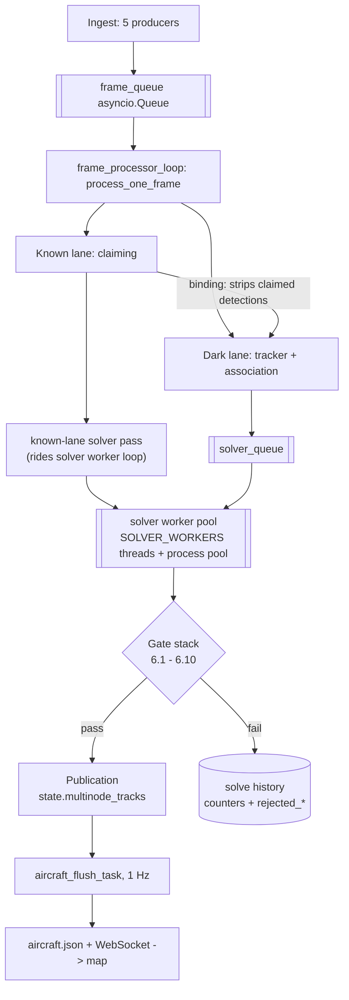
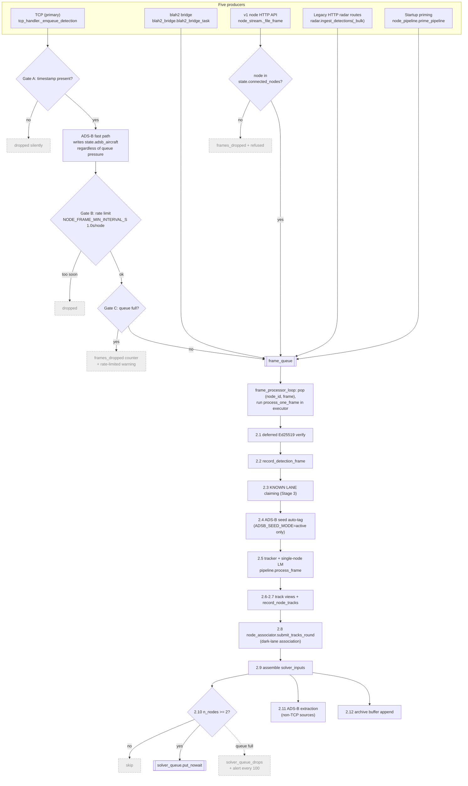
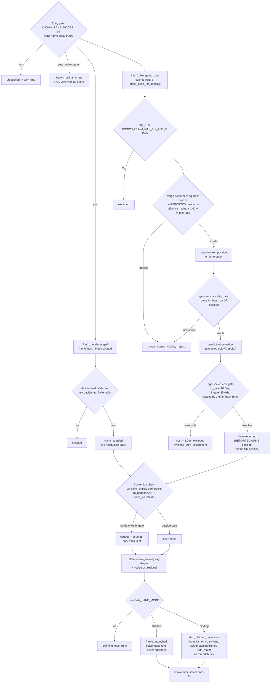
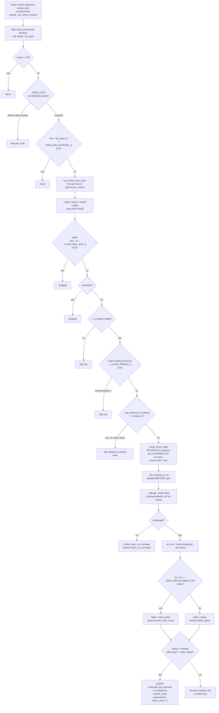
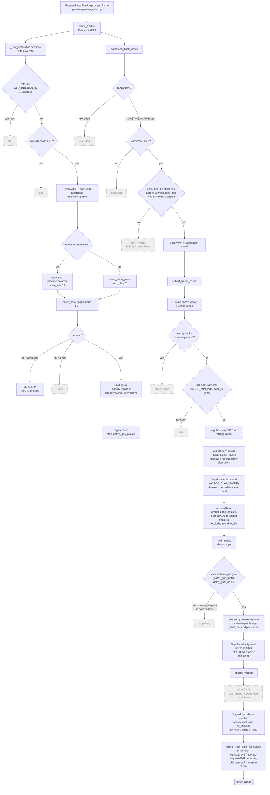
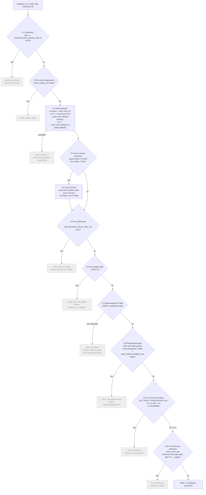
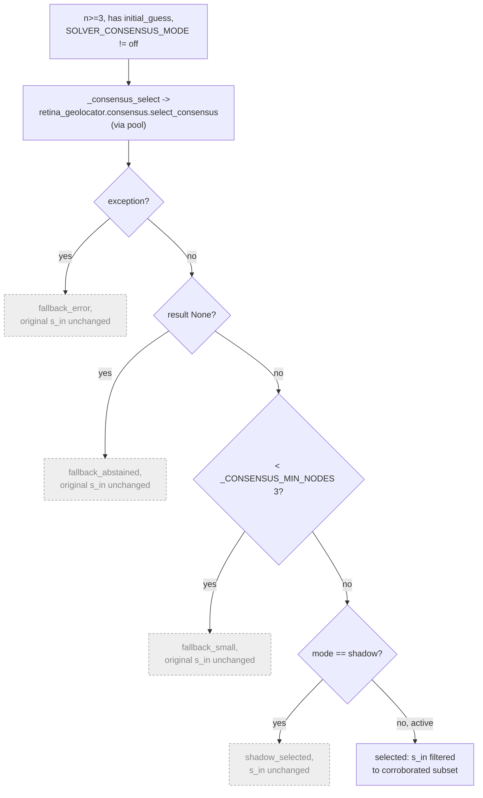
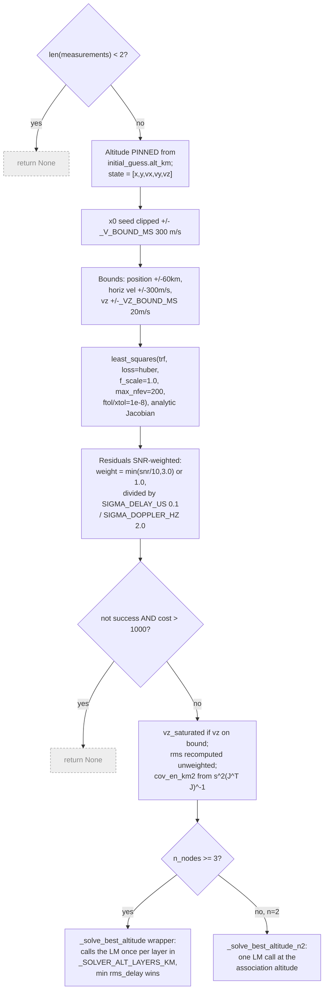

# Solving pipeline — visual map

This doc traces the **solving path**: detections landing on a TCP socket to
positioned aircraft on the map. It covers ingest, the frame driver, the known
lane, the dark lane, the solver gate stack, and publication.

It does **not** cover auth, HTTP routes, the dashboard, node registration/
ownership, or the simulation fleet — see [`architecture.md`](architecture.md)
for those. For per-track single-node display gates and feed assembly detail
beyond what publication needs, see [`pipeline.md`](pipeline.md) (its own §3 is
stale on the known lane and pool fallback — this doc is the current source for
those two topics).

References name a **file and a symbol**, never a line number: paths are
repo-relative to `backend/`, except the `libs/*` ones, which are already fully
qualified (those are separate submodule repos vendored under `libs/`). Line
numbers were what this document used to carry, and they were stale within two
weeks of being written — every one of them had drifted by the time anyone
followed it. A symbol survives an edit above it, so grep for the name.

## Legend

Solid arrows are the live path. Dashed arrows and the grey style mark branches
that exist in code but are switched off in production today (inline CV fit,
the bottom-up doppler gate, every mode flag except `KNOWN_LANE_MODE`). Diamonds
are gates; a failed gate either drops the item or routes it to a fallback —
labeled on the arrow.

---

## 1. Overview: two lanes, one pool

One frame_queue feeds N frame-processor workers. Each frame is split inline:
the known lane claims detections that match a live ADS-B identity, and
(only in `binding` mode) removes them before the dark lane's tracker and
association ever see them. Both lanes ultimately enqueue candidates onto the
**same** `solver_queue`, drained by the **same** worker threads — the known
lane rides the solver loop's idle cycles rather than owning workers of its
own. Everything that reaches a solve passes through one gate stack
(`_process_solver_item`) before publication.

| Constant | Value | Defined in |
|---|---|---|
| `frame_queue` size (`FRAME_QUEUE_SIZE`) | 10000 | `core/state.py` |
| `solver_queue` size (`SOLVER_QUEUE_SIZE`) | 200 | `core/state.py` |
| `FRAME_WORKERS` | 4 (compose sets 6) | `core/state.py` (`FRAME_WORKERS`), `docker-compose.yml` |
| `SOLVER_WORKERS` | 2 daemon threads + same-size process pool | `services/tasks/solver.py` (`_N_SOLVER_WORKERS`, `_make_solver_pool`) |
| `KNOWN_LANE_MODE` default | `binding` | `core/state.py` (`KNOWN_LANE_MODE`) |

---

## 2. Ingest and the per-frame driver

The ordering inside `process_one_frame` (`services/frame_processor.py`) is
load-bearing, not incidental: claiming (2.3) runs **before** ADS-B seeding
(2.4) so a node-supplied `adsb` field is still distinguishable from a claim,
and both run **before** the tracker (2.5) so that, in `binding` mode, a
claimed detection never reaches the dark-lane tracker or association at all
— see the ordering comment at the head of `process_one_frame`'s claiming step.
Frame-level gates (A/B/C on TCP, plus the connected-node check on the v1 API)
sit ahead of everything else; nothing downstream sees a frame that failed
one of them.

| Constant | Value | Defined in |
|---|---|---|
| Gate A: timestamp required | — | `tcp_handler._enqueue_detection` |
| Gate B: `NODE_FRAME_MIN_INTERVAL_S` | 1.0 s/node, counted as `node_frames_rate_limited` | `tcp_handler` (`_NODE_MIN_INTERVAL_S`, `_enqueue_detection`) |
| Gate C: QueueFull | `frames_dropped` counter | `tcp_handler._enqueue_detection` |
| `process_one_frame` entry | — | `services/frame_processor.py` |
| Ordering rationale (claim → seed → tracker) | — | `frame_processor.process_one_frame` |
| Gate 2.10: `n_nodes < 2` skip | — | `frame_processor.process_one_frame` |
| blah2 poll interval | 1.0 s | `config/constants.py` (`BLAH2_POLL_INTERVAL_S`) |

---

## 3. The known lane

The range prescreen is an optimization with no semantics of its own: its
radius (`effective_radius_km × _SCREEN_MARGIN` plus `_V_MAX_MS × |age|` of
possible aircraft motion, east-west scaled at the poleward edge of the screen,
longitude delta wrapped at the antimeridian) is provably weaker than every
branch of `_point_in_beam`, so it can only reject candidates the gate would
also reject — a differential property test in `test_known_claiming.py`
(`TestRangePrescreen`) holds the two paths verdict-identical. A prescreen
failure increments the same `known_claims_visibility_rejects` counter as a
gate failure: same event, same meaning, just caught cheaper.

**Mode semantics** (`KNOWN_LANE_MODE`, read once in `core/state.py`,
default `binding`; an unrecognized value falls back to `shadow`, not to the
default — a typo should degrade to the inert mode, not the acting one):

| Mode | Claiming | Frame the dark lane sees | Known-lane solver | Publication |
|---|---|---|---|---|
| `off` | never runs | untouched | returns 0 immediately (`known_lane.run_known_lane_pass`); worker never even calls it (`solver._run_solver_worker`) | none |
| `shadow` | runs, records claims + residuals + counters | untouched | runs: solves, classifies, records accuracy samples | never |
| `binding` | runs | `strip_claimed_detections` removes claimed indices (called from `frame_processor.process_one_frame`) | runs | `truth_match` results publish into `state.multinode_tracks` as `mn-adsb-<hex>`; ghosts never publish |

`strip_claimed_detections` (`services/known_claiming.py`) returns a copy
with claimed indices removed from `delay`/`doppler`/`snr`/`adsb`; the
original frame still feeds the archive and ADS-B extraction (steps 2.11-2.12)
unchanged.

### 3c. Known-lane solver pass

The module docstring of `services/tasks/known_lane.py` calls this the "free
solve invariant": the ADS-B fix seeds the initial guess and pins altitude,
nothing else — no regularization pulls the solve toward the truth position,
so the residual (`err_km`) is a genuine measurement of radar accuracy, not a
circular check. One more intentional-by-omission detail: known-lane
measurements carry `snr = 0.0` (claim records have no `snr` key), which the
LM's SNR weighting maps to a uniform weight of 1.0.

| Constant | Value | Defined in |
|---|---|---|
| `KNOWN_CLAIM_MAX_FIX_AGE_S` | 45.0 s | `known_claiming.py` (= `association.ADSB_SEED_MAX_DR_AGE_S`) |
| Path 2 gates: `KNOWN_CLAIM_DELAY_GATE_US` / `KNOWN_CLAIM_DOPPLER_GATE_HZ` | 10.0 us / 25.0 Hz, age-scaled | `known_claiming.py` (= `association.ADSB_SEED_DELAY_GATE_US` / `_DOPPLER_GATE_HZ`) |
| Prescreen slack `_SCREEN_MARGIN` | 1.02 | `known_claiming.py` |
| Prescreen speed bound `_V_MAX_MS` | 340.0 m/s | `association.py` |
| `CLAIM_MAX_GLOBAL_TRACKS` (contention reference cap, newest-first) | 200 | `association.py`, applied in `known_claiming._dark_global_projections` |
| Contention gates: `CLAIM_DELAY_GATE_US` / `CLAIM_DOPPLER_GATE_HZ` | 10.0 us / 25.0 Hz | `libs/retina-analytics/.../association.py` |
| `CLAIM_MAX_DR_AGE_S` (contention DR window) | 30.0 s | `association.py` |
| `CLAIM_ELIGIBLE_MIN_N_NODES` / `MIN_SOLVE_COUNT` | 3 / 2 | `association.py` |
| `KNOWN_CLAIMS_PER_HEX_MAX` | 64 | `core/state.py` |
| `_PASS_MIN_INTERVAL_S` | 2.0 s | `services/tasks/known_lane.py` |
| `_CLAIM_MAX_AGE_S` / `_CLAIM_SPREAD_S` | 45.0 s / 5.0 s | `known_lane.py` |
| `_ATTEMPT_TTL_S` | 600 s | `known_lane.py` |
| `_MAX_DISPLACEMENT_KM` (truth_match cutoff) | 2.0 km | `services/tasks/solver.py` |

---

## 4. The dark lane

`compute_overlap_zone` (`libs/retina-analytics/.../association.py`)
underlies both the confirmed-track association round and the overlap-grid
cache: it fast-prunes non-overlapping node pairs by receiver separation,
grids the shared coverage at `ASSOC_GRID_STEP_KM` on six altitude layers that
must match the solver's `_SOLVER_ALT_LAYERS_KM`, and requires each grid
column to fall in **both** beams (`_point_in_beam`, FOV-aware only when
`FOV_MODE=active`).

| Constant | Value | Defined in |
|---|---|---|
| `GEO_INTERVAL_S` (single-node geo rate limit) | 10.0 s | `config/constants.py` (applied as `_GEO_INTERVAL_S` in `_run_geolocation`) |
| Single-node min detections | 3 | `pipeline/passive_radar.py` (`_geolocate_track_event`, `min_det`) |
| `N2_TRACK_HISTORY_MAX` (track view window) | 20 | `config/constants.py` |
| `ADSB_VIEW_TAG_FRESH_N` | 3 | `frame_processor.py` |
| `ASSOC_MIN_INTERVAL_S` | 30.0 s | `config/constants.py` |
| `ASSOC_MAX_NEIGHBORS` | 50/round | `config/constants.py` |
| `ASSOC_MAX_PAIRS_PER_ROUND` / `_MAX_FITS_PER_ROUND` | 64 / 8 | `config/constants.py`, `association.py` |
| `delay_gate_us` (bottom-up coarse gate) | 5.0 us | `association.compute_overlap_zone` (default arg) |
| `doppler_gate_hz` (bottom-up) | 30.0 Hz, **inert** — delay-only grid gate | `association.compute_overlap_zone` (default arg) |
| velocity seed cap `_V_MAX_MS` | 340 m/s | `association.py` |
| `N2_CONFIRM_MIN_EPOCHS` / `MIN_SPAN_S` | 4 / 12.0 s | `config/constants.py` |
| `_MERGE_DIST_KM` (clustering) | 6.0 km | `association.InterNodeAssociator.format_track_pairs_for_solver` (local) |
| `ASSOC_GRID_STEP_KM` | 3.0 km | `config/constants.py` |
| `_SOLVER_ALT_LAYERS_KM` | [1.5, 3, 5, 7, 9, 11] km | `services/tasks/solver.py` |

---

## 5. The solver gate stack

The centerpiece: every candidate from either lane, once dequeued from
`solver_queue`, runs through `_process_solver_item`
(`services/tasks/solver.py`) as a strict, ordered chain. A failure at
any gate stops the chain, bumps a counter, and (from 6.5 onward) writes a
named record to solve history.

**Consensus sub-branch** (only n>=3, `initial_guess` present,
`SOLVER_CONSENSUS_MODE != off`, folded into gate 6.3):

`SOLVER_CONSENSUS_MODE` is `off` in production (see the mode-flag table in
[`architecture.md`](architecture.md#feature-gates)), so in practice
this sub-branch never reaches `active` outside staging.

### The LM itself

`solve_multinode` — `libs/retina-geolocator/retina_geolocator/multinode_solver.py`,
invoked through the process pool via `_pool_solve_multinode`
(`services/tasks/solver.py`).

| Constant | Value | Defined in |
|---|---|---|
| `_SOLVER_MAX_QUEUE_AGE_S` (6.1) | 45.0 s | `services/tasks/solver.py` |
| `SOLVER_RESOLVE_INTERVAL_S` (6.2) | 12 s (0 disables) | `services/tasks/solver.py` (`_SOLVER_RESOLVE_INTERVAL_S`) |
| `_TRIM_MAX_ROUNDS` / `_TRIM_RESID_FACTOR` / `_TRIM_MIN_NODES` (6.4) | 4 / 1.5 / 3 | `services/tasks/solver.py` |
| `SOLVER_RMS_DELAY_MAX_US` (6.5) | 3.0 us | `services/tasks/solver.py` (`_SOLVER_RMS_DELAY_MAX_US`) |
| `_SOLVER_RMS_DOPPLER_MAX_HZ` (6.6) | 200.0 Hz (hardcoded) | `services/tasks/solver.py` |
| `_MAX_DISPLACEMENT_KM` (6.8) | 2.0 km | `services/tasks/solver.py` |
| `N2_CONFIRM_CHI2_MAX` (6.9) | 2.0 | `config/constants.py` |
| `_TRACK_CLAIM_TTL_S` (6.10) | 60.0 s | `services/tasks/solver.py` |
| `_CONSENSUS_MIN_NODES` | 3 | `services/tasks/solver.py` |
| `_SIGMA_DELAY_US` / `_SIGMA_DOPPLER_HZ` | 0.1 / 2.0 | `multinode_solver.py` |
| `_V_BOUND_MS` / `_VZ_BOUND_MS` | 300.0 / 20.0 m/s | `multinode_solver.py` |

---

## 6. Publication and output

```mermaid
flowchart TD
    ok["All gates 6.1-6.10 passed"]
    ok --> book["solver_successes, solver_total_solved,<br/>latency; alert if > 30s"]
    book --> hexassign["result.adsb_hex = s_in.adsb_hex<br/>when present"]
    hexassign --> anom["_collect_track_anomalies<br/>(dark solves restricted to<br/>ARC_ONLY_ANOMALY_ALLOWLIST)"]
    anom --> velad{"CV velocity adoption:<br/>n_epochs>=4 AND<br/>chi2_per_dof <= CV_VEL_ADOPT_CHI2_MAX 5.0?"}
    velad -->|"yes"| cv["vel_source = cv_fit"]
    velad -->|"no"| slv["vel_source = solve"]
    cv --> untrust
    slv --> untrust["vel_untrusted =<br/>vz_saturated OR<br/>(vel_source==solve AND n<=3)"]

    untrust --> lock["under _MN_TRACKS_LOCK"]
    lock --> ident{"multinode_key_decision"}
    ident -->|"1. adsb_hex present"| kADSB["mn-adsb-hex"]
    ident -->|"2. anchor_key mn-dark-*,<br/>live, within 6.0km"| kAnchor["reuse anchor key"]
    ident -->|"3. DR proximity scan,<br/>0<=dt<=60s, best d/gate_km<br/>gate = 6.0 + 0.13*dt km, cap 12.0"| kDR["reuse best-scoring mn-dark-*"]
    ident -->|"4. none match"| kMint["mint mn-dark-ts-lat-lon"]

    kADSB --> smooth["track_filter.smooth_solve<br/>(TRACK_SMOOTHER: kf/ewma/off)"]
    kAnchor --> smooth
    kDR --> smooth
    kMint --> smooth
    smooth --> latch["anomaly latch vs previous entry"]
    latch --> supersede{"Supersession: other key sharing<br/>a source track id —<br/>_supersession_match?"}
    supersede -->|"DR into gate_km,<br/>or its ids subset this solve's"| popped["entry popped,<br/>EWMA/KF state dropped,<br/>solve_count carried forward<br/>(mn_superseded)"]
    supersede -->|"neither"| blocked["kept — shared id is<br/>cross-aircraft contamination<br/>(mn_superseded_blocked)"]:::inert
    popped --> store["state.multinode_tracks[key] = result"]
    blocked --> store
    store --> archive["track-archive buffer append"]
    archive --> histpub["_record_solve_history: published"]

    histpub --> feed["build_combined_aircraft_json<br/>(1 Hz flush)"]
    feed --> gN2{"n=2 display gate:<br/>solve_count < MN_N2_MIN_SOLVES 2?"}
    gN2 -->|"yes"| retainN2["retained, not rendered"]:::inert
    gN2 -->|"no"| gOneshot{"n>=3 one-shot:<br/>solve_count==1 AND<br/>age_s > MN_ONESHOT_TTL_S 15.0s?"}
    gOneshot -->|"yes"| dropOneshot["not rendered"]:::inert
    gOneshot -->|"no"| dr["dead reckoning,<br/>capped 30s"]
    dr --> dedup["dedup_aircraft:<br/>rank by _DEDUP_SOURCE_RANK,<br/>3.0km / 2000ft gate"]
    dedup --> out["aircraft.json + WebSocket -> map"]

    classDef inert fill:#eee,stroke:#999,color:#888,stroke-dasharray: 4 3
```

`position_source` values on feed entries:

| Value | Set at | Meaning |
|---|---|---|
| `multinode_solve` | `aircraft_feed.multinode_to_aircraft` | published multi-node solve |
| `solver_adsb_seed` | `track_gates.track_entry` | single-node LM with fresh ADS-B fix |
| `solver_single_node` | `track_gates.track_entry` | single-node LM, no ADS-B |
| `single_node_ellipse_arc` | `track_gates.track_entry` | overwrites either when an ambiguity arc exists — displayed point is the arc midpoint |
| `adsb_single_node` | `aircraft_feed._claimed_single_node_entries` | exactly one node claiming the hex within `CLAIMED_DISPLAY_FRESH_S`; position is the claim's ADS-B fix, the entry carries the node's full ambiguity arc. Two or more claiming nodes emit nothing here — that is the known-lane solver's `mn-adsb-<hex>` |
| `known_lane_truth_match` / `known_lane_ghost` | `known_lane._record_accuracy` | accuracy-sample-only, not a feed entry |

| Constant | Value | Defined in |
|---|---|---|
| `_MN_ASSOC_MAX_DIST_KM` / `_MN_ASSOC_MAX_AGE_S` (identity step 2/3) | 6.0 km / 60.0 s | `services/tasks/solver.py` |
| `_MN_ASSOC_DRIFT_KM_PER_S` / `_MN_ASSOC_MAX_DIST_CAP_KM` (step 3 only — the gate grows with the matched entry's age) | 0.13 km/s / 12.0 km | `services/tasks/solver.py` |
| Supersession gate (`_supersession_match`) — the same age-scaled `_mn_assoc_gate_km` and `_MN_ASSOC_MAX_AGE_S` as step 3, applied to the solve's RAW position | 6.0 + 0.13·dt km, cap 12.0 / 60.0 s | `services/tasks/solver.py` |
| `CV_VEL_ADOPT_CHI2_MAX` | 5.0 | `config/constants.py` |
| `MN_N2_MIN_SOLVES` | 2 | `config/constants.py` |
| `MN_ONESHOT_TTL_S` | 15.0 s | `config/constants.py` |
| `_DEDUP_SOURCE_RANK` order | multinode_solve 0 < adsb_single_node 1 < solver_adsb_seed 2 < solver_single_node 3 < single_node_ellipse_arc 4 | `services/feed_helpers.py` |
| `CLAIMED_DISPLAY_FRESH_S` | 5.0 s | `config/constants.py` |
| Dedup proximity / altitude gate | 3.0 km / 2000 ft | `services/feed_helpers.py` (`_DEDUP_PROXIMITY_KM`, `_DEDUP_ALT_GATE_FT`) |
| `AIRCRAFT_FLUSH_INTERVAL_S` | 1.0 s | `config/constants.py` |
| `DISPLAY_STALE_TRACK_S` / `GATE_MAX_HOLD_S` | 15 s / 10 s | `config/constants.py` |

---

## 7. Reading the pipeline from outside

Three endpoints answer questions about the two lanes, and each has a shape
worth knowing before it is trusted.

**`/api/test/mlat-history`** dumps solve records. Both lanes write their own
deque (`state.mlat_solve_history`, `state.mlat_solve_history_known`) and every
reader merges them. `?lane=dark|known|adsb|all` narrows the answer;
`?limit=` (default 1 000, max 5 000) is applied **per lane**, so a known-lane
burst can never push dark records out of the response — the flat cap that
preceded it left a 30 min request holding only the newest ~6 min of dark
records, which reads exactly like a quiet dark lane. `lane_counts` is
reported pre-cap so a truncated `records` list is legible.
`?kind=resolve_skips` dumps a different store entirely — see below.

**`/api/test/solver-stats`** is the Solver Report panel's source. Its funnel,
error percentiles, ghosts, fragmentation, `contamination` and `resolve_skips`
are all the DARK lane; `lane_split` gives the per-lane record counts and
`known_lane` that lane's own numbers.

| Block | Says | Watch for |
|---|---|---|
| `contamination` | Of the dark records that matched ground truth, how many carried a node that could not see the aircraft (`foreign_node_ids` on the record; verdict is the associator's own `_point_in_beam`, the same gate known-lane claiming uses) | `pct` is the live version of the offline ~60 % the cluster-splitting work exists to move. Records with no GT match, or no registered geometry for any contributing node, are **out of the denominator** — abstention, not innocence |
| `resolve_skips` | Candidates the re-solve suppression refused in this window, from `state.solver_resolve_skips_recent`, with the claims that blocked each one | `attempts_ratio` is all-lane skips over DARK attempts (live baseline ~2.4). The deque holds 500 entries against ~50 skips/min, so read `window_effective_minutes` before reading `total` as a window count |
| `counters.resolve_skips_dark` | Dark share of the since-boot skip counter | — |
| `counters.node_frames_rate_limited` | Frames `NODE_FRAME_MIN_INTERVAL_S` refused before the tracker saw them (Gate B in §2) | Not the same event as `/api/admin/metrics`' `frames_dropped`, which is `frame_queue` saturation and normally reads zero |

A skip is deliberately **not** a solve-history record: skips outrun dark
records roughly two to one on the live fleet, so writing them into
`mlat_solve_history` would evict exactly the solves an investigation needs.
They are also not counted as attempts or rejects — a skipped candidate never
reached a solve.

---

## Caveats

- **A shared source track id does not identify an aircraft.** Single-node
  tracker track ids are reused across the association candidates of different
  aircraft: in a 6-minute live window, 74 of 178 track ids appeared in
  published solves of more than one ground-truth aircraft. Supersession
  therefore treats the shared id only as a cheap prefilter and requires
  `_supersession_match` to agree — the old entry dead-reckons inside the
  age-scaled gate, or its source track ids are a non-empty subset of the new
  solve's (identical inputs, which is the anchor-merge case). Before that
  guard, 36 of 44 supersessions popped a different aircraft's key and dark
  keys churned at 7.4/min with a 7 s median lifetime (2.4/min and 33 s before
  the dark publish rate rose); replayed over the same 139 live solves the
  guard cuts mints 47 → 22 and cross-aircraft pops 36 → 7.
  `mn_superseded` / `mn_superseded_blocked` in `/api/test/solver-stats`
  (`fragmentation`) and `superseded_keys` / `superseded_blocked` on each
  published `mlat_solve_history` record are how this is watched.
- **Node-trust residuals are measure-only.** `node_bias.py` computes them but
  nothing in the solver consumes them yet (`node_bias.py` module docstring).
- **`docs/pipeline.md` §3 is stale.** It predates the known lane and the
  process-pool inline fallback; this doc supersedes it for both topics.
- **The bottom-up doppler gate is inert.** `doppler_gate_hz` in the dark
  lane's coarse pairing step is defined but the grid gate is delay-only in
  practice (`association.compute_overlap_zone`'s `doppler_gate_hz`).
- **Production runs with every mode flag off** except `KNOWN_LANE_MODE`, which
  is `binding` everywhere by code default and is set in no environment's
  `.env`. The in-repo statement of what each environment sets is
  [`architecture.md`](architecture.md#feature-gates); the actual
  values live in the gitignored `backend/.env` on each host, not in this
  repo.
